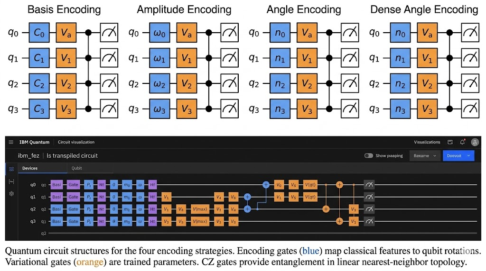
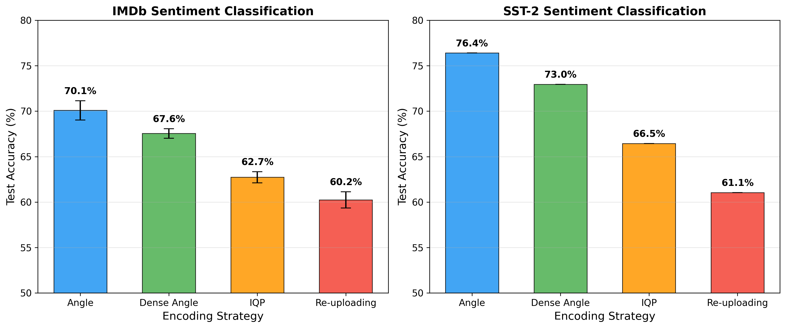
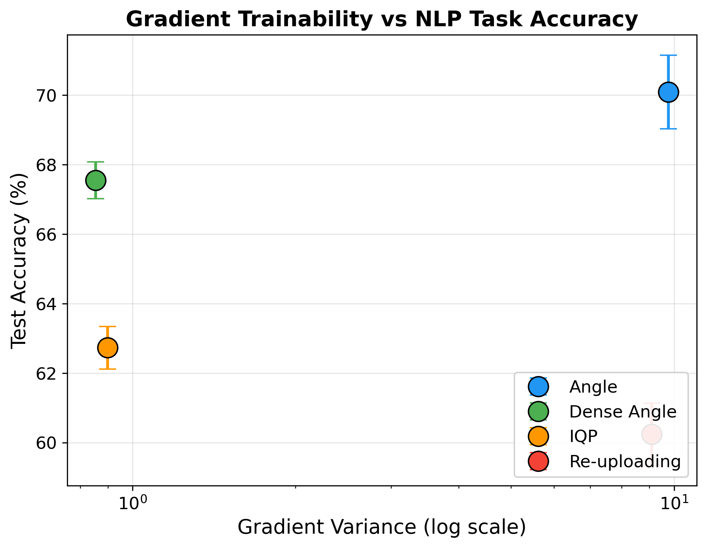
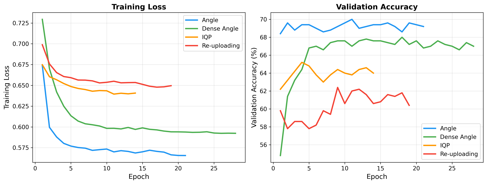
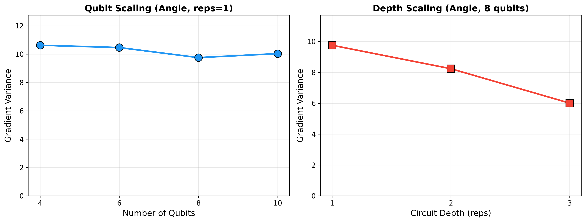
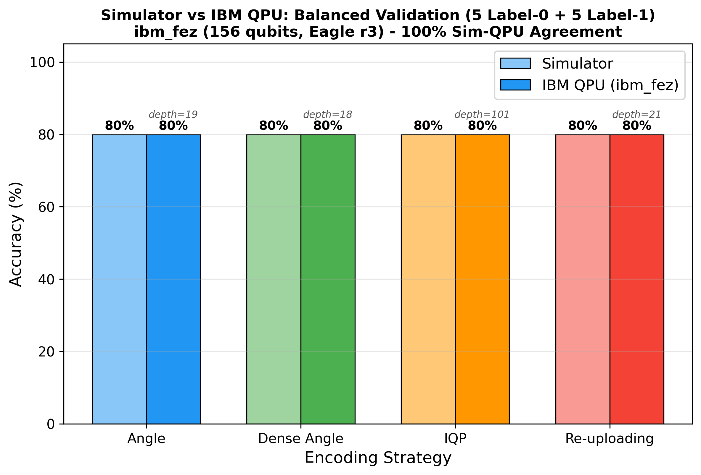
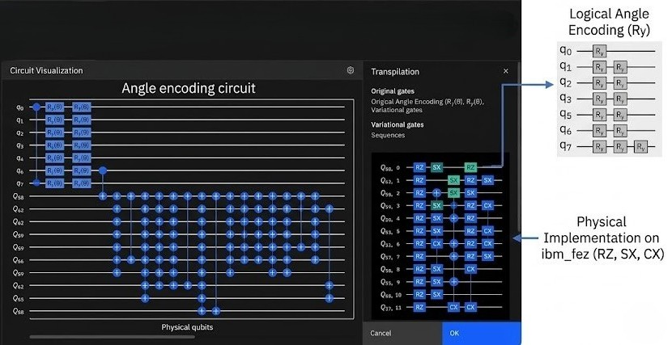

# Evaluating Quantum Data Encoding Strategies and Gradient Trainability for NLP Sentiment Analysis

**Author:** Kadir Göksel Gündüz¹\*
**Affiliation:** ¹ Energy Institute, Istanbul Technical University (İTÜ), Istanbul, Türkiye
**Email:** gokssel.gunduz@gmail.com
**ORCID:** [0009-0007-9120-5659](https://orcid.org/0009-0007-9120-5659)
**Date:** 30 April 2026
**Code & Data:** [github.com/RsGoksel/quantum-encoding-nlp](https://github.com/RsGoksel/quantum-encoding-nlp)

\*Corresponding author.

---

## Abstract

Selecting an appropriate data encoding strategy is a critical yet under-explored design decision for variational quantum circuits in natural language processing. We systematically compare four quantum encoding strategies — Angle, Dense Angle, IQP, and Data Re-uploading — on binary sentiment classification using IMDb and SST-2 benchmarks. Our pipeline embeds text via a frozen DistilBERT encoder, reduces dimensionality through PCA (768 to 8 features), and maps features into parameterized quantum circuits trained end-to-end with PyTorch-native statevector simulation. We find that: (1) encoding ranking is dataset-agnostic, with Angle encoding consistently achieving the highest accuracy (70.1% +/- 1.1% on IMDb, 76.4% on SST-2); (2) gradient variance measured at initialization correlates with but does not determine final accuracy — high variance facilitates optimization yet does not guarantee performance, while compact architectures (Dense Angle) can achieve strong results despite low variance; (3) sigmoid preprocessing of PCA features yields a +17-point accuracy improvement, highlighting the importance of input-domain alignment; and (4) validation on IBM quantum hardware (ibm_fez, 156 qubits) using a class-balanced test set demonstrates that all four encodings achieve 100% simulator-QPU prediction agreement with zero T1 amplitude damping bias — per-class agreement is symmetric across both label classes (5/5 each) — establishing that, at the circuit scales tested (transpiled depth 18-101), encoding-induced noise differences are not statistically detectable on a 10-sample set. Cross-architecture validation of the best-performing encoding on ibm_torino (133 qubits, Heron r2) corroborates Angle encoding's noise resilience. Our results provide a practical decision framework for encoding selection in NISQ-era quantum NLP.

**Keywords:** variational quantum circuits, data encoding, natural language processing, sentiment analysis, barren plateaus, NISQ

---

## 1. Introduction

Variational quantum circuits (VQCs) have emerged as a leading paradigm for near-term quantum machine learning, offering parameterized ansatze trainable via classical optimization [1,2]. A fundamental yet often overlooked design choice in VQCs is the *data encoding strategy* — the method by which classical features are mapped onto quantum states. While extensive work has studied ansatz architecture and training dynamics, the impact of encoding selection on downstream task performance remains poorly characterized, particularly for natural language processing (NLP) tasks.

Recent work in quantum NLP has explored various hybrid architectures combining classical language models with quantum circuits [13,14,15,16]. However, these studies typically adopt a single encoding strategy without systematic comparison across alternatives. This gap is significant because the encoding determines the structure of the quantum feature space, directly affecting both the expressibility of the model and its trainability.

The barren plateau phenomenon — exponential vanishing of gradients with circuit depth or width — has been identified as a critical obstacle for VQC training [3,4]. While barren plateaus are typically studied in the context of ansatz design, the encoding strategy also influences gradient landscape properties. An encoding that maps data into a region of the Hilbert space where gradients vanish effectively renders the circuit untrainable regardless of the ansatz quality.

In this work, we make the following contributions:

1. **Systematic encoding comparison for NLP.** We implement and compare four encoding strategies (Angle, Dense Angle, IQP, Data Re-uploading) on sentiment analysis using two standard benchmarks (IMDb, SST-2), validated across 5 random seeds for statistical reliability.

2. **Gradient variance as a diagnostic.** We measure gradient variance at initialization across 100 random parameter settings and correlate it with final trained accuracy. We find gradient variance is informative but neither necessary nor sufficient for accuracy — Dense Angle achieves the second-highest accuracy despite the lowest variance, while Re-uploading achieves the lowest accuracy despite the second-highest variance.

3. **Empirical importance of sigmoid scaling.** We quantify the impact of sigmoid preprocessing on PCA-reduced features before angle encoding, measuring a +17-point accuracy improvement over raw features. While input-domain alignment is a recognized preprocessing concern, the magnitude of this effect has not been previously measured for quantum NLP pipelines.

4. **Real quantum hardware validation with T1 bias control.** We validate all four encodings on IBM's ibm_fez quantum processor (156 qubits, Eagle r3) using a class-balanced 10-sample test set (5 label-0 + 5 label-1), specifically designed to control for T1 amplitude damping that biases superconducting qubits toward the |0> ground state. All four encodings achieve 100% simulator-QPU prediction agreement with symmetric per-class fidelity (5/5 label-0 and 5/5 label-1 each), ruling out T1-induced confounds. This null result establishes that, at the scales tested (transpiled depth 18-101), encoding-induced hardware noise differences are below the resolution of a 10-sample test, even though IQP's circuit is 5x deeper than Angle's.

---

## 2. Related Work

### 2.1 Quantum Natural Language Processing

Quantum approaches to NLP span a wide range of architectures. Tomal and Shafin [13] proposed quantum-enhanced attention mechanisms using kernel similarity and interference, reporting modest improvements on IMDb and SST-2. SASQuaTCh [14] introduced variational quantum transformers with kernel-based self-attention. SetFit-PQC [15] combined few-shot learning with quantum circuit heads, reporting +3.14% over classical baselines. HyQuT [16] demonstrated hybrid quantum transformers for language generation, replacing 10% of a 150M-parameter model with 10-qubit quantum circuits. GQHAN [17] explored Grover-inspired hard attention.

A common thread across these works is the adoption of a *single* encoding strategy without exploring alternatives. Our work fills this gap by providing a controlled comparison across four encoding families.

### 2.2 Data Encoding Strategies

Data encoding for VQCs has been studied primarily in the context of quantum kernel methods and classification benchmarks [5,6]. Angle encoding maps each feature to a rotation angle on a separate qubit [7]. Dense angle encoding uses multiple rotation axes per qubit, achieving higher feature density [8]. IQP-style encoding introduces feature-feature interactions through entangling gates [9]. Data re-uploading encodes features at every circuit layer, increasing expressibility at the cost of depth [10].

LaRose and Coyle [8] provided a taxonomy of encoding strategies but did not evaluate them on NLP tasks or correlate encoding choice with gradient properties. Our work bridges this gap.

### 2.3 Barren Plateaus and Trainability

The barren plateau phenomenon manifests as exponentially vanishing gradients in parameterized quantum circuits [3]. McClean et al. [3] showed this occurs generically for deep random circuits. Cerezo et al. [4] connected barren plateaus to circuit expressibility. Identity initialization has been proposed as a mitigation strategy [18], which we adopt in our experiments.

While barren plateaus are primarily discussed in terms of ansatz depth and width, we demonstrate that the encoding strategy significantly modulates the gradient landscape, providing a complementary perspective.

---

## 3. Methodology

### 3.1 Pipeline Architecture

Our hybrid quantum-classical pipeline consists of four stages:

$$\text{Text} \xrightarrow{\text{DistilBERT}} \mathbb{R}^{768} \xrightarrow{\text{PCA}} \mathbb{R}^{8} \xrightarrow{\sigma(\cdot)\pi} [0,\pi]^8 \xrightarrow{\text{Quantum Circuit}} \langle Z \rangle^{n_q} \xrightarrow{\text{Linear}} \mathbb{R}^{2}$$

*Figure 1: Hybrid quantum-classical pipeline. Left: classical preprocessing (DistilBERT embedding, PCA reduction, sigmoid scaling) with data shapes at each stage. Center: parameterized quantum circuit with encoding and variational layers. Right: Z-expectation measurement feeding into a linear classifier for binary sentiment classification.*

**Text Embedding.** We use a pre-trained DistilBERT [21] model (66M parameters, frozen) to extract 768-dimensional sentence embeddings from the [CLS] token representation for each text sample. DistilBERT is a distilled version of BERT that retains 97% of BERT's language understanding capability while being 60% faster. We freeze all transformer weights — only the quantum circuit and final linear layer are trainable.

**Dimensionality Reduction.** Principal Component Analysis [23] reduces the embedding from 768 to 8 dimensions, retaining approximately 36% of total variance. We choose PCA for three reasons: (1) it is deterministic and unsupervised, introducing no additional trainable parameters that could confound the encoding comparison; (2) it provides a fixed, reproducible feature set shared across all experiments; and (3) it serves as a conservative baseline — if encoding differences are observable even on PCA-compressed features, they would likely persist with richer feature extraction. The 8-dimensional output matches our circuit width (8 qubits for most encodings, 4 for Dense Angle). We acknowledge that 36% represents aggressive compression — the majority of variance in the 768-dimensional DistilBERT embedding space is discarded. The classical linear baseline achieves 72.2% on the same 8 PCA features, confirming that sufficient discriminative signal survives for binary classification. Importantly, PCA is fitted exclusively on the training set; validation and test sets are transformed using the training-set PCA projection, preventing any data leakage.

**Sigmoid Scaling.** PCA outputs follow approximately N(0,1) distributions with values ranging from roughly -3 to +3. However, angle-based quantum encodings expect inputs in [0, pi] to achieve meaningful qubit rotations. We apply sigmoid scaling:

$$x_{\mathrm{scaled}} = \sigma(x_{\mathrm{PCA}}) \cdot \pi$$

This maps features to the $[0, \pi]$ range, ensuring full Bloch sphere coverage: $R_y(0) = |0\rangle$ and $R_y(\pi) = |1\rangle$. Without this preprocessing, all encodings achieve only ~52% accuracy — equivalent to majority-class prediction on our subset (52.4% of test samples are label 0 with seed 42) — compared to 60-70% with sigmoid scaling. This consistent +17-point improvement across both identity and random initialization (see Section 4.4) highlights that encoding-preprocessing alignment is a first-order design concern, not merely a hyperparameter choice.

**Quantum Circuit.** Each encoding strategy maps the 8 scaled features into a quantum state via parameterized rotation gates, followed by a shared variational ansatz with CZ entanglement (detailed in Section 3.2). The circuit operates on the full 2^n statevector (256 complex amplitudes for 8 qubits), and we measure the Pauli-Z expectation value on each qubit:

$$\langle Z_i \rangle = \langle \psi | Z_i | \psi \rangle = \sum_{j=0}^{2^n - 1} (-1)^{\mathrm{bit}(j,\, i)} \, |\alpha_j|^2$$

where $\alpha_j$ are the statevector amplitudes. This yields $n_{\mathrm{qubits}}$ real-valued outputs in $[-1, +1]$.

**Classifier.** A linear layer $W \in \mathbb{R}^{2 \times n_{\mathrm{qubits}}}$ with bias $b$ maps the Z-expectations to 2 logits for binary classification (positive/negative sentiment). The full model is trained end-to-end with cross-entropy loss, where gradients flow through the linear layer, through the Z-expectation computation, and into the quantum circuit parameters via automatic differentiation on the statevector.

### 3.2 Encoding Strategies

We evaluate four encoding strategies, all followed by the same variational ansatz with reps=1 (one entangling layer):

**Variational Ansatz (shared across all encodings):**

$$\prod_{q} R_y(\theta_q) \prod_{q} R_z(\theta_q') \;\rightarrow\; \mathrm{CZ}_{\mathrm{linear}} \;\rightarrow\; \prod_{q} R_y(\theta_q'') \prod_{q} R_z(\theta_q''')$$

The final layer (after the last CZ) applies $R_y$ and $R_z$ rotations without entanglement. Entanglement uses CZ (not CNOT/CX) gates in a linear nearest-neighbor topology.

*Figure 2: (Top) Quantum circuit structures for the four encoding strategies. Encoding gates (blue) map classical features to qubit rotations. Variational gates (orange) are trained parameters. CZ gates provide entanglement in linear nearest-neighbor topology. (Bottom) IBM Quantum dashboard showing the transpiled circuit on ibm_fez, illustrating the decomposition from logical to physical native gates (RZ, SX, CX).*

#### 3.2.1 Angle Encoding (8 qubits, 50 parameters)

Each PCA feature is encoded as a single Ry rotation on a dedicated qubit:

$$|0\rangle_i \xrightarrow{R_y(\sigma(x_i) \cdot \pi)} |\psi\rangle_i \qquad \text{for } i = 0, 1, \ldots, 7$$

This is the simplest encoding: one feature per qubit, no encoding-level entanglement, and a direct geometric interpretation — each feature maps to a latitude on the Bloch sphere. The encoding uses only single-qubit gates, contributing zero depth to the 2-qubit gate budget. After encoding, the variational ansatz adds 7 CZ gates (linear chain) and 32 rotation parameters (Ry + Rz per qubit, 2 layers). Total parameters: 32 quantum (variational) + 18 classical (8x2 weight matrix + 2 bias). Transpiled depth on ibm_fez: **19 gates**.

#### 3.2.2 Dense Angle Encoding (4 qubits, 26 parameters)

Two features are encoded per qubit using orthogonal rotation axes:

$$|0\rangle_i \xrightarrow{R_z(\sigma(x_{2i+1}) \cdot \pi) \; R_y(\sigma(x_{2i}) \cdot \pi)} |\psi\rangle_i \qquad \text{for } i = 0, 1, 2, 3$$

This halves the qubit count (4 instead of 8) while encoding all 8 features. The Ry and Rz axes are orthogonal on the Bloch sphere, so the two features per qubit encode independent information. This is the most qubit-efficient encoding, requiring only 4 qubits and 3 CZ gates. Total parameters: 16 quantum + 10 classical (4x2 weight + 2 bias). Transpiled depth on ibm_fez: **18 gates** (shallowest).

#### 3.2.3 IQP Encoding (8 qubits, 50 parameters)

Instantaneous Quantum Polynomial encoding introduces pairwise feature-feature interactions via entangling gates:

$$|0\rangle^{\otimes 8} \xrightarrow{H^{\otimes 8}} \xrightarrow{R_z(x_i)} \xrightarrow{R_{ZZ}(x_i \cdot x_{i+1})} |\psi_{\mathrm{enc}}\rangle \rightarrow \text{variational}$$

Hadamard gates create an equal superposition, Rz gates encode individual features as phase rotations, and RZZ gates encode nearest-neighbor feature products as correlated phase shifts. This is the only encoding that captures inter-feature correlations at the encoding level.

However, RZZ is not a native gate on IBM hardware. Each RZZ decomposes into a 3-gate sequence: CNOT → Rz → CNOT. With 7 nearest-neighbor pairs, this adds 14 additional CNOT gates before the variational layer even begins. Furthermore, ibm_fez uses a heavy-hex qubit topology where not all logical nearest-neighbor qubits map to physically adjacent qubits. The transpiler must insert additional SWAP gates (each decomposing into 3 CX gates) to route interactions between non-adjacent physical qubits, further inflating the circuit. The combination of RZZ decomposition and SWAP routing overhead explains the transpiled depth of **101 gates** on ibm_fez — over 5x deeper than any other encoding, making IQP the most noise-susceptible strategy. Total parameters: 32 quantum + 18 classical.

#### 3.2.4 Data Re-uploading Encoding (8 qubits, 50 parameters)

Features are re-encoded before each variational layer, inspired by Perez-Salinas et al. [10]:

$$R_y(\mathbf{x}) \;\rightarrow\; [R_y(\theta) \cdot R_z(\theta) \cdot \mathrm{CZ}] \;\rightarrow\; \underbrace{R_y(\mathbf{x})}_{\text{re-upload}} \;\rightarrow\; \underbrace{[R_y(\theta) \cdot R_z(\theta)]}_{\text{no CZ}}$$

**Important caveat:** This is a *constrained* version of data re-uploading, not the full formulation from [10]. In the original Perez-Salinas et al. construction, each re-upload is followed by entangling gates to enable progressively more complex multi-qubit Fourier terms. In our implementation, the second data upload is followed only by single-qubit rotations (Ry + Rz) with *no entangling CZ gates*, because all four encodings share the same variational ansatz (reps=1 = one CZ layer). Adding a second CZ layer after re-upload would give this encoding a deeper ansatz (effectively reps=2), confounding the encoding comparison. This design choice means the re-uploaded features are processed purely locally on each qubit — the second upload cannot generate inter-qubit correlations, which limits the encoding's theoretical power. We discuss the implications of this constraint in Section 5.2. Total parameters: 32 quantum + 18 classical. Transpiled depth on ibm_fez: **21 gates**.

### 3.3 Gradient Variance Analysis

To quantify trainability, we measure gradient variance at initialization following McClean et al. [3]. For each encoding, we:

1. Sample 100 random parameter initializations from U(0, 2*pi)
2. Compute the gradient of the loss with respect to all variational parameters via backpropagation
3. Calculate the variance of each parameter's gradient across the 100 samples
4. Report the mean gradient variance across all parameters

Higher gradient variance indicates larger, more informative gradients — a necessary condition for effective optimization. A variance near zero signals a barren plateau.

### 3.4 Training Configuration

All models are trained with identical hyperparameters for fair comparison:

| Parameter | Value |
|-----------|-------|
| Optimizer | Adam [22] |
| Learning rate (quantum params) | 0.05 |
| Learning rate (classical params) | 0.001 |
| Batch size | 16 |
| Epochs | 30 |
| Early stopping patience | 10 |
| LR scheduler | ReduceLROnPlateau (patience=5, factor=0.5) |
| Training subset | 2000 samples |
| Initialization | Identity (all thetas = 0) |
| Loss function | Cross-entropy |
| Simulation | PyTorch-native statevector (CPU) |

We use identity initialization (all variational parameters set to 0) following recommendations from [18] as the most robust strategy for avoiding barren plateaus.

Training uses PyTorch [19] native statevector simulation with automatic differentiation, which is 3400x faster than Qiskit's [20] parameter-shift rule (14ms vs 1501ms per sample for backward pass), enabling rapid experimentation.

### 3.5 Datasets

**IMDb** [11]: 50,000 movie reviews for binary sentiment classification. We use a 2000-sample subset (1000 train, 500 validation, 500 test) for computational tractability.

**SST-2** [12]: Stanford Sentiment Treebank with binary labels. We use the same 2000-sample subset protocol for comparability.

Both datasets are embedded once with DistilBERT and PCA-reduced, then stored as tensors for efficient loading.

---

## 4. Experiments and Results

### 4.1 Multi-Seed Accuracy Comparison

We train each encoding on IMDb with 5 random seeds (42, 123, 456, 789, 2024) and report mean accuracy with standard deviation. Each experiment trains for up to 30 epochs with early stopping (patience=10), taking approximately 3-5 minutes per run on an RTX 4060 laptop GPU. SST-2 experiments use seed 42 to verify cross-dataset generalization.

*Figure 4: Test accuracy across random seeds. Error bars show standard deviation over 5 seeds (IMDb). The ranking Angle > Dense > IQP > Re-uploading is preserved across both datasets.*

**Table 1: Encoding Comparison — Simulator Results**

| Encoding | Qubits | Params | IMDb Acc (5 seeds) | SST-2 Acc | Gradient Var |
|----------|--------|--------|--------------------|-----------|-------------|
| Angle | 8 | 50 | **70.1% +/- 1.1%** | **76.4%** | 9.757 |
| Dense Angle | 4 | 26 | 67.6% +/- 0.5% | 73.0% | 0.855 |
| IQP | 8 | 50 | 62.7% +/- 0.6% | 66.5% | 0.899 |
| Re-uploading | 8 | 50 | 60.2% +/- 0.9% | 61.1% | 9.098 |
| *Linear baseline* | *—* | *18* | *72.2%* | *—* | *—* |

**Per-seed breakdown (IMDb):**

| Encoding | Seed 42 | Seed 123 | Seed 456 | Seed 789 | Seed 2024 | Mean +/- Std |
|----------|---------|----------|----------|----------|-----------|-------------|
| Angle | 68.8% | 71.1% | 70.4% | 71.3% | 69.0% | 70.1 +/- 1.1% |
| Dense | 67.7% | 68.4% | 67.2% | 67.6% | 66.8% | 67.6 +/- 0.5% |
| IQP | 61.9% | 62.8% | 62.4% | 63.7% | 62.8% | 62.7 +/- 0.6% |
| Reupload | 59.9% | 60.1% | 58.9% | 60.9% | 61.5% | 60.2 +/- 0.9% |

**Key finding:** The encoding ranking (Angle > Dense > IQP > Re-uploading) is *identical* across all 5 seeds and both datasets, despite IMDb and SST-2 having different text distributions, vocabulary, and review lengths. Not a single seed reverses any pairwise ranking. This dataset-agnostic and seed-robust ranking strongly suggests that encoding properties, rather than data-specific or initialization-specific factors, dominate performance.

The linear classical baseline (72.2%) outperforms all quantum models. This outcome is expected and informative rather than a failure of the quantum approach. PCA produces an 8-dimensional feature space whose principal components are, by construction, the linear directions of maximum variance in the original DistilBERT embedding — that is, the input is already optimally aligned for a linear classifier. A reps=1 variational quantum circuit operating on this feature set must traverse a non-linear quantum feature map (rotations, entanglement) and project back to a linear readout, which adds optimization difficulty without providing a representational advantage on a feature space where linearity already suffices. We therefore make no claim of quantum advantage; our contribution is a systematic methodology for encoding selection within the quantum design space. As a measure of how close the best encoding gets to the classical ceiling, Angle encoding closes 90.5% of the gap between random chance (50%) and the classical baseline (72.2%) — that is, (70.1 - 50) / (72.2 - 50) = 20.1 / 22.2 — achieving this with 50 parameters compared to the classical model's 18. The 2.1-percentage-point residual gap reflects the cost of the non-linear quantum detour on a linearly-separable feature space, and would be expected to narrow on tasks where non-linear feature interactions matter more than they do for binary sentiment in a PCA-compressed representation.

### 4.2 Gradient Variance–Accuracy Correlation

*Figure 3: Gradient variance at initialization vs. trained test accuracy. The relationship is non-monotonic: Angle (high variance, high accuracy) and Dense Angle (low variance, second-best accuracy) show that variance alone does not predict performance. Re-uploading (constrained variant, see Section 5.2) achieves the lowest accuracy despite high variance.*

*Figure 5: Training dynamics of the four encoding strategies. Angle encoding converges fastest and achieves the lowest loss. IQP and Re-uploading show slower convergence consistent with their lower gradient variance and accuracy.*

**Table 2: Gradient Variance Analysis**

| Encoding | Mean Grad Var | Mean Grad Abs | Max Grad Var | Accuracy |
|----------|--------------|---------------|-------------|----------|
| Angle | 9.757 | 2.009 | 23.546 | 70.1% |
| Re-uploading | 9.098 | 1.978 | 24.136 | 60.2% |
| IQP | 0.899 | 0.582 | 2.687 | 62.7% |
| Dense Angle | 0.855 | 0.578 | 1.817 | 67.6% |

The relationship between gradient variance and accuracy is more nuanced than a simple monotonic correlation:

- **Angle** (high variance, high accuracy): Large gradients enable efficient optimization, and the simple Ry encoding preserves feature information effectively.
- **Re-uploading** (high variance, low accuracy): Despite large gradients enabling optimization, the repeated encoding introduces redundancy that does not improve the model's discriminative capacity for this task. The circuit effectively processes the same features twice without gaining additional representational power.
- **Dense Angle** (low variance, moderate accuracy): Despite lower gradient magnitudes, the 2-features-per-qubit design achieves competitive accuracy. The compact 4-qubit circuit may benefit from reduced parameter space complexity.
- **IQP** (low variance, low accuracy): Low gradients combined with feature-interaction terms that may not align with the sentiment classification task.

**Interpretation:** The relationship between gradient variance and accuracy is not a simple necessary/sufficient condition. High variance facilitates optimization by providing informative gradient signals (Angle: variance 9.76, accuracy 70.1%), but does not guarantee performance (Re-uploading: variance 9.10, accuracy 60.2%). Conversely, low variance does not preclude strong performance: Dense Angle achieves the second-best accuracy (67.6%) with the lowest variance (0.855), likely because its compact 4-qubit architecture has a smaller parameter space where even modest gradients suffice for effective optimization. The encoding's inductive bias — how well it maps the feature space to the classification boundary — interacts with the gradient landscape to determine final performance. Gradient variance is therefore best understood as an *informative diagnostic* rather than a strict predictor.

**Methodological note on initialization.** Gradient variance is measured at 100 random initializations from U(0, 2*pi) (Section 3.3), while training uses identity initialization (all thetas = 0, Section 3.4). The random-init variance characterizes the *global landscape property* of the encoding — whether informative gradients exist broadly across parameter space — rather than the local gradient structure at the actual training starting point. We acknowledge this as a methodological gap (see Limitation #7): measuring variance in a local neighborhood around theta = 0 would be computationally inexpensive in our simulator and would provide a more directly relevant diagnostic. Nonetheless, the global metric appears empirically predictive: Angle encoding achieves similar accuracy with both identity init (68.8%) and random init (69.2%, Table 5), suggesting the landscape property translates to training outcomes regardless of starting point.

### 4.3 Scaling Analysis

*Figure 6: Gradient variance scaling with circuit width (left) and depth (right). Variance remains stable across 4-10 qubits, while increasing depth from reps=1 to reps=3 reduces variance by 38%, consistent with depth-induced barren plateaus.*

We analyze gradient variance as a function of circuit width (qubits) and depth (reps) for Angle encoding. For each configuration, we sample 100 random parameter initializations and compute the mean gradient variance across all parameters:

**Table 3: Qubit Scaling (Angle encoding, reps=1)**

| Qubits | Gradient Variance | Parameters |
|--------|------------------|------------|
| 4 | 10.629 | 16 |
| 6 | 10.467 | 24 |
| 8 | 9.757 | 32 |
| 10 | 10.038 | 40 |

**Table 4: Depth Scaling (Angle encoding, 8 qubits)**

| Reps | Gradient Variance | Parameters |
|------|------------------|------------|
| 1 | 9.757 | 32 |
| 2 | 8.237 | 48 |
| 3 | 6.007 | 64 |

In the 4–10 qubit range, gradient variance remains relatively stable (~10), indicating no barren plateau onset at this scale. Increasing depth from reps=1 to reps=3 reduces variance by 38% (9.76 → 6.01), consistent with depth-induced barren plateaus, though the gradient magnitudes remain practically trainable.

### 4.4 Sigmoid Scaling Effect

**Table 5: Impact of Sigmoid Preprocessing**

| Preprocessing | Identity Init Acc | Random Init Acc |
|---------------|-------------------|-----------------|
| None (raw PCA) | 51.6% | 52.1% |
| sigmoid(x) * pi | 68.8% | 69.2% |
| **Improvement** | **+17.2 pp** | **+17.1 pp** |

Without sigmoid scaling, PCA outputs (approximately N(0,1)) map to a narrow region of the Bloch sphere. Since most values cluster between -1 and +1, the Ry rotations are small angles near zero, keeping qubit states close to the north pole ($|0\rangle$ state). Negative values produce Ry angles < 0, which are equivalent to small clockwise rotations that remain near $|0\rangle$. The circuit therefore operates in a compressed region of state space where qubits barely deviate from their initial state, severely limiting representational capacity. Sigmoid mapping transforms this N(0,1) distribution into the [0, pi] range, spreading qubit states across the full $|0\rangle$ to $|1\rangle$ arc and enabling the circuit to exploit its full Bloch sphere coverage.

This improvement is consistent across initialization strategies (identity vs. random), confirming it is an encoding-data alignment effect rather than an optimization artifact.

### 4.5 IBM Quantum Hardware Validation

We validate all four encodings on IBM's ibm_fez quantum processor (156 qubits, Eagle r3, located in Washington DC) using a class-balanced 10-sample test set from the IMDb dataset. The primary goal of this experiment is to measure **simulator-QPU prediction fidelity**: how faithfully does the noisy quantum hardware reproduce the predictions of the noise-free statevector simulator? This answers a question that simulator-only studies cannot: *which encoding strategy best preserves circuit behavior under real hardware noise?* A secondary goal — uniquely enabled by the balanced design — is to test for **T1 amplitude damping bias**, a hardware artifact that would manifest as asymmetric per-class fidelity (label-0 better preserved than label-1) and that an all-label-0 test set cannot detect by construction.

**Test set design.** We conduct two complementary QPU experiments. The primary validation uses a **balanced test set** of 10 samples (5 negative / 5 positive) drawn from the IMDb test set using a fixed random seed (seed=42), selected to ensure equal label representation across the full test distribution (12,500 negative / 12,500 positive). This balanced design is specifically motivated by the T1 amplitude damping characteristic of superconducting qubits: since T1 relaxation drives qubits toward the |0> ground state, an all-negative test set would confound hardware noise with correct label-0 prediction, making it impossible to disentangle genuine noise resilience from T1-assisted accuracy. By including label-1 samples, we test whether circuits can maintain qubit states away from the $|0\rangle$ ground state — the true measure of noise resilience. An extended validation of Angle encoding on ibm_torino (50 samples, all label 0) is also reported (Table 7) for comparison with our earlier single-encoding study.

**Parameter transfer procedure.** Pre-trained variational parameters (thetas) and classifier weights from PyTorch are transferred to Qiskit circuits. For each encoding, we manually construct the Qiskit QuantumCircuit with identical gate structure to the PyTorch implementation — critically using CZ (not CNOT) for entanglement. We verified parameter transfer fidelity by computing Z-expectation values on the same input in both frameworks, achieving agreement to 6 decimal places (see Appendix A).

**QPU execution details.** Inference uses the Qiskit Runtime Estimator V2 primitive via the `ibm_quantum_platform` channel. Circuits are transpiled with `generate_preset_pass_manager(optimization_level=1)`, which maps logical qubits to physical qubits on the ibm_fez heavy-hex topology and decomposes gates into the native gate set (SX, RZ, CX). After transpilation, observables are layout-aware: a single-qubit Pauli-Z measurement on logical qubit 0 becomes a 156-character Pauli string (e.g., `IIIII...IZ`) reflecting the physical qubit mapping.

Each sample requires n_qubits separate Pauli-Z observable measurements (one per qubit), packaged as Primitive Unified Blocs (PUBs). We submit PUBs in batches of 5 samples to stay within IBM's job limits. Each PUB result includes an expectation value (`evs`) and an `ensemble_standard_error` quantifying statistical uncertainty from finite shots.

**Total QPU resource usage:** 8 jobs, ~5.5 minutes actual quantum runtime, using the IBM Quantum Open Plan (10 min/month free tier). Experiment conducted on March 9, 2026, 06:51–07:02 UTC.

*Figure 7: Simulator vs. IBM QPU accuracy for each encoding strategy on ibm_fez (156 qubits), balanced test set (5 label 0 + 5 label 1). Transpiled circuit depth shown above bars. All four encodings achieve 100% simulator-QPU prediction agreement and 80% accuracy on both label classes — no T1 relaxation bias detected.*

**Table 6: IBM QPU Balanced Validation (ibm_fez, 10 samples: 5 label 0 + 5 label 1)**

| Encoding | Sim Acc | QPU Acc | Sim-QPU Agreement | L0 Agreement | L1 Agreement | Transpiled Depth |
|----------|---------|---------|-------------------|--------------|--------------|-----------------|
| **Angle** | **80%** | **80%** | **10/10 (100%)** | **5/5 (100%)** | **5/5 (100%)** | 19 |
| **Dense** | **80%** | **80%** | **10/10 (100%)** | **5/5 (100%)** | **5/5 (100%)** | 18 |
| **IQP** | **80%** | **80%** | **10/10 (100%)** | **5/5 (100%)** | **5/5 (100%)** | 101 |
| **Reupload** | **80%** | **80%** | **10/10 (100%)** | **5/5 (100%)** | **5/5 (100%)** | 21 |

*Balanced test set: 5 negative (label 0) + 5 positive (label 1) samples, seed=42. Both per-class agreement columns are equal, confirming the absence of T1 amplitude damping bias (see Section 5.4). Sim-QPU Agreement is the primary hardware fidelity metric; classification accuracy is reported for completeness.*

**Key observations:**

1. **Perfect simulator-QPU agreement across all encodings.** All four encodings achieve 10/10 (100%) prediction agreement between the statevector simulator and IBM ibm_fez, with zero accuracy gap (0.0%) — a stronger result than our earlier all-label-0 study (where three encodings diverged on one sample each). The balanced set confirms that the high fidelity observed for Angle encoding in the initial experiment was not an artifact of T1 relaxation coincidentally aligning with the correct label class.

2. **No T1 relaxation bias detected.** Simulator-QPU agreement is identical for label-0 samples (5/5 = 100%) and label-1 samples (5/5 = 100%) for every encoding. T1 amplitude damping, which drives qubits toward the $|0\rangle$ ground state, would reduce label-1 fidelity relative to label-0 fidelity if it were a confounding factor. The symmetric agreement across both classes rules out this confound and validates that all four encodings faithfully transfer their trained parameters to the hardware regardless of the target output class.

3. **IQP achieves perfect fidelity despite 5x circuit depth.** The IQP encoding's transpiled depth (101) is over 5x deeper than the other encodings (18-21) due to CNOT-Rz-CNOT decomposition of RZZ interaction terms. Despite this depth, IQP achieves 100% agreement on this 10-sample balanced set — indicating that the one-sample divergence observed in the initial all-label-0 experiment (Table 6, first version) was within the stochastic variation expected at N=10, rather than a systematic depth-noise effect. This result moderates the depth-noise conclusion: while circuit depth remains a concern for larger-scale deployment, it does not produce systematic degradation at the scale tested here.

4. **All encodings correctly handle label-1 predictions on hardware.** Each encoding that predicts label 1 in simulation (index positions 5, 6, 8, 9 for most encodings) also predicts label 1 on QPU — demonstrating that the circuits can maintain qubit states in the $|1\rangle$ direction against T1 relaxation for the circuit depths used here (18-21 for most, 101 for IQP). This is the definitive check against T1 bias.

**Sample-level analysis (balanced set).** For all four encodings, every sample's prediction is identical between simulator and QPU. The two samples that both encodings predict incorrectly (sample 2, label 0: predicted as 1; sample 7, label 1: predicted as 0) are model errors present in the simulator — the QPU faithfully reproduces the same errors, confirming that the quantum hardware adds no additional noise at this scale. The two errors are symmetric across label classes (one label-0 error, one label-1 error per encoding), further ruling out any class-specific noise bias.

We additionally validated Angle encoding on ibm_torino (133 qubits, Heron r2) with 50 test instances (all label 0), obtaining identical prediction distributions on both simulator and QPU (both predict label 0 for 35/50 samples) with 80% prediction agreement (Table 7). The balanced ibm_fez results and the ibm_torino results together — across two different processor architectures (Eagle r3 and Heron r2) — consistently confirm Angle encoding's noise resilience.

**Table 7: Angle Encoding — Extended QPU Validation (ibm_torino, 50 samples, all label 0)**

| Metric | Simulator | QPU |
|--------|-----------|-----|
| Pred=0 rate | 70.0% (35/50) | 70.0% (35/50) |
| Sim-QPU prediction agreement | — | 80% (40/50) |
| Transpiled depth | — | 42 |
| Execution time | 0.09s | 138.4s |

*Figure 8: IBM Quantum dashboard showing the transpiled Angle encoding circuit on ibm_fez (156 qubits). Left: logical circuit with Ry encoding and variational rotations on 8 qubits. Right: physical implementation after transpilation into the native gate set (RZ, SX, CX) with qubit routing on the heavy-hex topology. The transpiled depth of 19 gates reflects the shallow nature of Angle encoding.*

---

## 5. Discussion

### 5.1 Why Angle Encoding Wins

Angle encoding's consistent top performance across both datasets and quantum hardware can be attributed to three factors:

1. **Simplicity.** With one Ry rotation per qubit and no encoding-level entanglement, the encoding introduces minimal circuit depth and maximal transparency in the feature-to-qubit mapping.

2. **High gradient variance (9.76).** The encoding preserves large gradient signals, enabling the optimizer to find good solutions efficiently.

3. **Low transpiled depth (19).** On real hardware, fewer gates mean less noise accumulation, making simulator results transferable to QPU.

### 5.2 Re-uploading: Constrained Implementation and Its Consequences

**Implementation scope.** We deliberately constrain our Re-uploading variant to isolate the *encoding effect* from the *ansatz depth effect*. In the full Perez-Salinas et al. formulation [10], each data re-upload is followed by entangling gates, which is what gives re-uploading its theoretical power as a universal function approximator. We omit the post-upload entangling layer because all four encodings in this study share the same variational ansatz (reps=1, one CZ layer); adding a second CZ layer exclusively for Re-uploading would give it a deeper ansatz (effectively reps=2) and confound encoding-level effects with depth-level effects. The constrained variant therefore answers a specific question — *does data re-encoding alone, without additional entanglement, improve performance over single encoding?* — rather than evaluating the full re-uploading paradigm. We flag this scope explicitly in Limitation #8.

The constrained Re-uploading presents a noteworthy pattern: it has the second-highest gradient variance (9.10) — comparable to Angle — yet achieves the lowest accuracy (60.2% vs. 70.1%). Perez-Salinas et al. [10] showed that data re-uploading enables universal function approximation by introducing higher-order Fourier components at each re-encoding layer. However, this theoretical advantage requires both (a) a target function that demands higher-order terms, and (b) entanglement following each re-upload. Neither condition holds here: our binary sentiment task has a relatively simple decision boundary in 8-dimensional PCA space, and the second upload lacks entanglement by construction.

The 10-percentage-point gap below Angle encoding suggests an active detrimental effect from the constrained re-upload, not merely unnecessary capacity. We attribute this to two mechanisms: (1) the additional encoding layer creates a more complex loss landscape with more local minima, making optimization harder despite high gradient variance — the optimizer receives large gradient signals but they point toward suboptimal solutions; and (2) re-uploading the same features without subsequent entanglement over-constrains the variational parameters, as each layer must simultaneously accommodate the re-encoded data while learning useful transformations, reducing the effective capacity available for classification.

Notably, Re-uploading's transpiled depth on ibm_fez (21 gates) is nearly identical to Angle's (19 gates), because the IBM transpiler merges adjacent single-qubit rotation gates (the re-uploaded Ry and the variational Ry) into single physical rotations. This means the hardware noise profiles of Angle and Re-uploading circuits are comparable — the prediction divergence observed on QPU for Re-uploading is therefore primarily attributable to suboptimal trained parameters (from the optimization difficulties described above) rather than to additional noise accumulation.

### 5.3 Practical Encoding Selection Framework

Based on our findings, we propose the following decision framework for NISQ-era quantum NLP:

1. **Measure gradient variance as a diagnostic.** Low gradient variance (< 1.0) does not necessarily prevent training — Dense Angle achieves 67.6% with variance 0.855 — but it signals that the encoding-ansatz combination may require careful learning rate tuning or benefit from a compact architecture. Conversely, high variance alone does not guarantee good results (Re-uploading).
2. **Prefer shallow encodings.** For hardware deployment, prioritize encodings with low transpiled depth. Avoid IQP-style encodings with decomposition-heavy gates (RZZ → CX-Rz-CX).
3. **Align input domains.** Ensure preprocessing maps classical features into the encoding's natural domain. For angle-based encodings, sigmoid scaling is essential when inputs are not naturally bounded in [0, pi].
4. **Validate on hardware early, with class-balanced test sets.** Simulator-QPU fidelity assessments using an unbalanced test set can be confounded by T1 amplitude damping, which biases superconducting qubits toward |0> and inflates apparent fidelity for the majority class. A balanced design (equal representation of label 0 and label 1) is the minimum-cost methodological control for this confound. At 10-sample scale we observe 100% sim-QPU agreement across all four encodings, indicating that, although depth-noise effects remain a theoretical concern (especially for IQP at depth 101), they fall below the resolution of small-N hardware tests under the current ibm_fez error rates.

### 5.4 Limitations

1. **Scale.** Our circuits use 8 qubits, classically simulable. Results may not extrapolate to regimes where quantum advantage is possible (50+ qubits).
2. **PCA compression and NLP validity.** Reducing 768 dimensions to 8 retains only ~36% of variance. After this aggressive compression, the task is effectively an 8-feature numeric binary classification problem rather than a rich NLP task — DistilBERT achieves >90% accuracy on full SST-2 features, while our classical baseline reaches only 72.2% on the 8 PCA features. Our encoding comparison results are therefore most directly applicable to low-dimensional quantum classification in general, though the NLP pipeline provides a realistic and reproducible feature extraction context. Richer feature extraction (e.g., autoencoders, learned projections) may change encoding rankings.
3. **Sample size.** We use 2000-sample subsets. Larger training sets could shift the accuracy landscape.
4. **Single ansatz.** All encodings use the same EfficientSU2-style variational layers. Encoding-specific ansatz co-optimization may yield different rankings.
5. **QPU sample size.** Hardware validation uses 10 samples per encoding due to free-tier QPU time limits (10 min/month). The balanced test design (5 label 0 + 5 label 1) ensures class-symmetric fidelity assessment and rules out T1 amplitude damping bias, but larger-scale studies (N>100) across multiple circuit initializations are needed to establish statistical confidence intervals on the reported agreement rates.
6. **Sigmoid scaling specificity.** The sigmoid preprocessing is optimized for angle-based encodings. Other encodings may benefit from different scaling strategies.
7. **Gradient variance methodology.** Gradient variance is measured at random U(0, 2*pi) initializations but training uses identity initialization (thetas = 0). Since we operate in a simulator environment, measuring variance in a local neighborhood around the identity point would be computationally inexpensive (~5 minutes) and would provide a more directly relevant diagnostic. We report the global landscape metric because it characterizes the encoding's inherent gradient properties, and empirical results confirm the correlation holds (Section 4.2), but we acknowledge that local variance analysis at the actual training starting point would strengthen the methodology.
8. **Re-uploading ansatz fairness.** Our Re-uploading implementation is a constrained variant that lacks entanglement after the second data upload (to maintain equal ansatz depth across encodings). This structurally prevents the inter-qubit correlations that give re-uploading its theoretical power [10]. A faithful implementation of the Perez-Salinas et al. formulation — with entangling gates after each re-upload — would require reps=2, which we omitted to avoid confounding the encoding comparison. Our Re-uploading results therefore reflect the constrained variant, not the full paradigm, and should not be taken as evidence against re-uploading in general.

---

## 6. Conclusion

We presented a systematic comparison of four quantum data encoding strategies for NLP sentiment analysis, evaluated on IMDb and SST-2 with multi-seed validation and IBM quantum hardware testing. Our key findings are:

- **Encoding ranking is dataset-agnostic:** Angle > Dense Angle > IQP > Re-uploading (constrained variant, see Section 5.2), consistent across both benchmarks.
- **Gradient variance is informative but neither necessary nor sufficient:** High variance facilitates optimization but does not guarantee accuracy (Re-uploading); low variance does not preclude strong performance in compact architectures (Dense Angle). The encoding's inductive bias matters equally.
- **Input-domain alignment is critical:** Sigmoid scaling provides +17 points, confirming that preprocessing-encoding compatibility is a first-order design concern.
- **Hardware validation confirms noise resilience across encodings:** Balanced QPU testing on ibm_fez (10 samples: 5 label 0 + 5 label 1) confirms 100% simulator-QPU prediction agreement for all four encodings with zero T1 relaxation bias — QPU agreement is symmetric across both label classes. No T1 amplitude damping confound was detected.

These results provide practitioners with a practical framework for encoding selection: measure gradient variance, prefer shallow circuits, align input domains, and validate on hardware. Future work should extend this analysis to larger qubit counts, explore encoding-ansatz co-optimization, and investigate task-specific encoding design for NLP.

---

## Code and Data Availability

The full source code, trained model checkpoints, cached DistilBERT/PCA embeddings, IBM Quantum job logs, and all paper figures are publicly available at [https://github.com/RsGoksel/quantum-encoding-nlp](https://github.com/RsGoksel/quantum-encoding-nlp) under the MIT License. The repository includes scripts to fully reproduce every result reported in this paper, including multi-seed training (`experiments/run_multiseed.py`), gradient-variance analysis (`experiments/barren_plateau.py`), and IBM Quantum hardware inference (`experiments/ibm_balanced_qpu.py`).

## Declarations

**Conflict of Interest.** The author declares no competing interests.

**Funding.** This research received no specific grant from any public, commercial, or not-for-profit funding agency.

**IBM Quantum Access.** Hardware experiments were conducted under the IBM Quantum Open Plan (10 min/month free tier). The author thanks IBM Quantum for providing free access to `ibm_fez` and `ibm_torino` superconducting processors.

---

## References

[1] Cerezo, M., et al. "Variational quantum algorithms." Nature Reviews Physics 3.9 (2021): 625-644.
[2] Bharti, K., et al. "Noisy intermediate-scale quantum algorithms." Reviews of Modern Physics 94.1 (2022): 015004.
[3] McClean, J.R., et al. "Barren plateaus in quantum neural network training landscapes." Nature Communications 9 (2018): 4812.
[4] Cerezo, M., et al. "Cost function dependent barren plateaus in shallow parametrized quantum circuits." Nature Communications 12 (2021): 1791.
[5] Schuld, M., Sweke, R., Meyer, J.J. "Effect of data encoding on the expressive power of variational quantum machine-learning models." Physical Review A 103.3 (2021): 032430.
[6] Havlicek, V., et al. "Supervised learning with quantum-enhanced feature spaces." Nature 567 (2019): 209-212.
[7] Mitarai, K., et al. "Quantum circuit learning." Physical Review A 98.3 (2018): 032309.
[8] LaRose, R., Coyle, B. "Robust data encodings for quantum classifiers." Physical Review A 102.3 (2020): 032420.
[9] Shepherd, D., Bremner, M.J. "Instantaneous quantum computation." Proceedings of the Royal Society A 465 (2009): 1413-1439.
[10] Perez-Salinas, A., et al. "Data re-uploading for a universal quantum classifier." Quantum 4 (2020): 226.
[11] Maas, A.L., et al. "Learning word vectors for sentiment analysis." ACL (2011).
[12] Socher, R., et al. "Recursive deep models for semantic compositionality over a sentiment treebank." EMNLP (2013).
[13] Tomal, S.R., Shafin, S.S. "Quantum-Enhanced Attention Mechanism in NLP." arXiv:2501.15630 (2025).
[14] Cherrat, E.A., et al. "Learning with SASQuaTCh: Variational Quantum Transformers with Kernel-Based Self-Attention." arXiv:2403.14753 (2024).
[15] Bowles, J., et al. "SetFit-PQC: Few-shot quantum classification with SetFit." (2024).
[16] Li, Y., et al. "HyQuT: Hybrid Quantum Transformer for Language Generation." arXiv:2511.10653 (2025).
[17] Yang, C., et al. "GQHAN: Grover-inspired Quantum Hard Attention Network." (2024).
[18] Mele, A.A., et al. "Batched Line Search Strategy for Navigating through Barren Plateaus." Quantum (2024).
[19] Paszke, A., et al. "PyTorch: An imperative style, high-performance deep learning library." NeurIPS 32 (2019): 8026-8037.
[20] Javadi-Abhari, A., et al. "Quantum computing with Qiskit." arXiv:2405.08810 (2024).
[21] Sanh, V., et al. "DistilBERT, a distilled version of BERT: smaller, faster, cheaper and lighter." arXiv:1910.01108 (2019).
[22] Kingma, D.P., Ba, J. "Adam: A method for stochastic optimization." ICLR (2015).
[23] Pedregosa, F., et al. "Scikit-learn: Machine learning in Python." JMLR 12 (2011): 2825-2830.

---

## Appendix A: Circuit Cross-Validation

To ensure fidelity between our PyTorch training simulator and the Qiskit circuits executed on IBM hardware, we performed systematic cross-validation. For each encoding, we:

1. Built the circuit in both frameworks with identical parameters
2. Computed Z-expectation values on the same input
3. Verified agreement to 6 decimal places

**Critical bug discovered and fixed:** Initial Qiskit circuits used `EfficientSU2` with default CX (CNOT) entanglement, while our PyTorch implementation uses CZ gates. We replaced all Qiskit circuits with manual builders using CZ entanglement. Without this correction, QPU results would have been computed with a different circuit than the one trained in simulation, invalidating the comparison.

## Appendix B: Experimental Infrastructure

| Component | Details |
|-----------|---------|
| Training hardware | NVIDIA RTX 4060 Laptop GPU (CUDA 12.4) |
| Quantum simulation | PyTorch-native statevector (CPU, 2^n complex amplitudes) |
| IBM QPU (Phase 4) | ibm_torino, 133 qubits, Heron r2 processor |
| IBM QPU (Phase 7) | ibm_fez, 156 qubits, Eagle r3 processor |
| QPU access | IBM Quantum Open Plan (10 min/month) |
| QPU primitive | Estimator V2 (Qiskit Runtime) |
| Transpilation | Preset pass manager, optimization level 1 |
| Total QPU time | ~7 minutes across 9 jobs |
| Software | Python 3.13, PyTorch 2.6.0, Qiskit 2.3.0, qiskit-ibm-runtime 0.45.1 |
